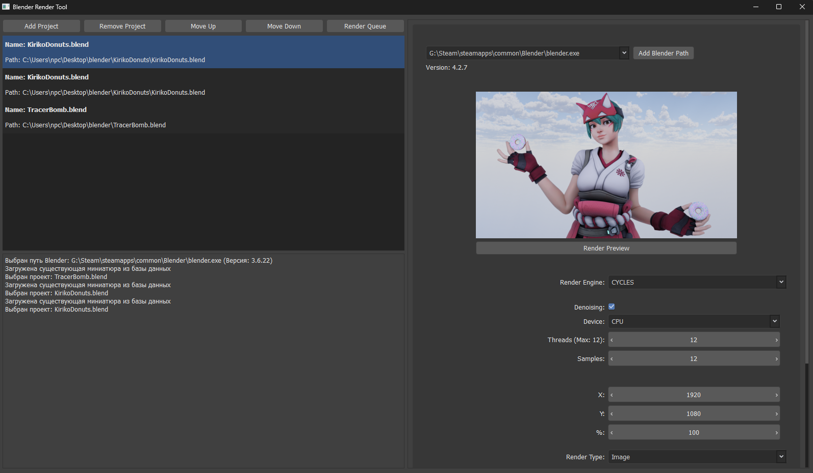
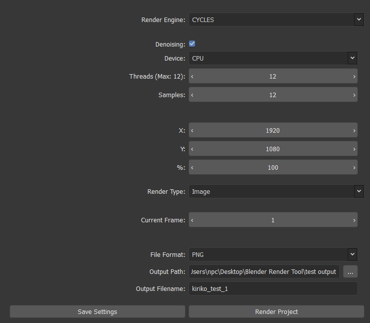

## Blender Render Tool
Приложение для упрощения работы с рендером в Blender путем организации очереди проектов с возможностью изменения основных настроек без запуска приложения Blender.

Совместимо с версиями Blender 3.0 и выше (от 3.6 возможны баги в связи с обновлением названий в API Blender и переходом с EEVEE на EEVEE_NEXT)

## Функции

### Добавление проектов в очередь на рендер
Список проектов которые будут последовательно рендерится с помощью установленных версий Blender.

### Изменение индивидуальных настроек каждого из добавленных проектов
Каждый проект настраивается отдельно, даже если исходный файл проекта один и тот же (позволяет получить рендер одного и того же проекта с разными настройками).

### Выбор версии Blender используемой в рендеринге
Поддержка обнаружения и добавления установленных версий Blender.

### Работа рендеринга в фоне
Запуск отдельного процесса Blender в фоне.

### Отслеживание процесса рендеринга
Логи работы программы в основном графическом интерфейсе.

### Предпросмотр проектов (предварительный рендер в более низком качестве)
Отдельное окно предпросмотра, которое рендерится по нажатию кнопок и сохраняется для использования в будущем.

## TODO
Поддержка рендера анимаций (на данный момент рендер конкретного кадра).

Кроссплатформенность (на данный момент только Windows)

Расширение изменяемых настроек проектов (добавление выбора камер и т.д.)

Улучшение графического интерфейса (графическое оформление прогресса рендера и улучшение UX/UI дизайна)

## Стек
### Python, PyQt6, SQLite, Blender API

## Скриншоты
### Основной интерфейс

### Блок настроек проекта

